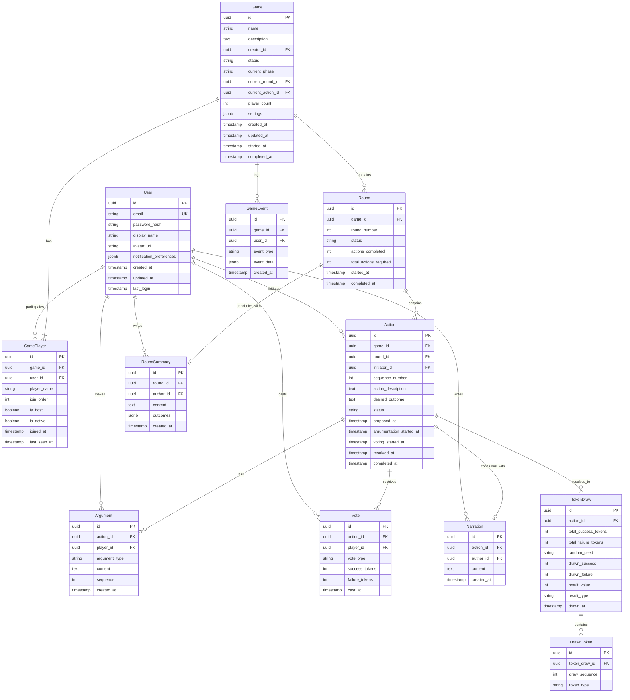

# Entity Relationship Diagram (ERD)

## Mosaic Strict Matrix Game - Database Schema v1.0

**Document Version:** 1.0  
**Last Updated:** January 31, 2026

---

## 1. Overview

This ERD defines the database schema for the Mosaic Strict Matrix Game web application v1.0. The schema supports asynchronous play-by-post action resolution mechanics for multiple concurrent games.

### 1.1 Design Principles

- **Server as source of truth**: All game state stored server-side
- **Auditability**: Complete history of all actions and state changes
- **Concurrency**: Support multiple games and players simultaneously
- **Scalability**: Optimized for read-heavy operations (viewing > acting)

### 1.2 Database Technology

**Recommended**: PostgreSQL 14+

- ACID compliance for game state consistency
- JSON support for flexible data storage
- Strong typing and constraints
- Excellent performance for read-heavy workloads

**Alternative**: MySQL 8+, SQLite (development only)

---

## 2. Entity Relationship Diagram (Mermaid)



---

## 3. Entity Specifications

### 3.1 User

**Purpose**: Represents a registered user account.

**Attributes:**

| Column                   | Type         | Constraints             | Description                         |
| ------------------------ | ------------ | ----------------------- | ----------------------------------- |
| id                       | UUID         | PK                      | Unique user identifier              |
| email                    | VARCHAR(255) | NOT NULL, UNIQUE        | User's email address                |
| password_hash            | VARCHAR(255) | NOT NULL                | Bcrypt hashed password              |
| display_name             | VARCHAR(50)  | NOT NULL                | Name shown to other players         |
| avatar_url               | VARCHAR(500) | NULL                    | URL to user avatar (gravatar, etc.) |
| notification_preferences | JSONB        | NOT NULL, DEFAULT '{}'  | Email, push notification settings   |
| created_at               | TIMESTAMP    | NOT NULL, DEFAULT NOW() | Account creation time               |
| updated_at               | TIMESTAMP    | NOT NULL, DEFAULT NOW() | Last profile update                 |
| last_login               | TIMESTAMP    | NULL                    | Last successful login               |

**Indexes:**

- PRIMARY KEY (id)
- UNIQUE INDEX (email)
- INDEX (created_at)

**Business Rules:**

- Email must be verified before user can create games
- Display name must be unique within a game (enforced at application level)
- Password must meet minimum security requirements (8+ chars, mixed case, numbers)

---

### 3.2 Game

**Purpose**: Represents a game session containing multiple actions.

**Attributes:**

| Column            | Type         | Constraints             | Description                                                                    |
| ----------------- | ------------ | ----------------------- | ------------------------------------------------------------------------------ |
| id                | UUID         | PK                      | Unique game identifier                                                         |
| name              | VARCHAR(100) | NOT NULL                | Game/session name                                                              |
| description       | TEXT         | NULL                    | Optional setting/context                                                       |
| creator_id        | UUID         | NOT NULL, FK → User.id  | User who created the game                                                      |
| status            | VARCHAR(20)  | NOT NULL                | LOBBY, ACTIVE, PAUSED, COMPLETED                                               |
| current_phase     | VARCHAR(20)  | NOT NULL                | WAITING, PROPOSAL, ARGUMENTATION, VOTING, RESOLUTION, NARRATION, ROUND_SUMMARY |
| current_round_id  | UUID         | NULL, FK → Round.id     | Active round                                                                   |
| current_action_id | UUID         | NULL, FK → Action.id    | Active action being resolved                                                   |
| player_count      | INT          | NOT NULL, DEFAULT 0     | Number of active players                                                       |
| settings          | JSONB        | NOT NULL, DEFAULT '{}'  | Game configuration options                                                     |
| created_at        | TIMESTAMP    | NOT NULL, DEFAULT NOW() | Game creation time                                                             |
| updated_at        | TIMESTAMP    | NOT NULL, DEFAULT NOW() | Last state change                                                              |
| started_at        | TIMESTAMP    | NULL                    | When game moved from LOBBY to ACTIVE                                           |
| completed_at      | TIMESTAMP    | NULL                    | When game was completed                                                        |

**Indexes:**

- PRIMARY KEY (id)
- INDEX (creator_id)
- INDEX (status, current_phase)
- INDEX (created_at)

**Settings JSONB Structure:**

```json
{
  "argument_limit": 3,
  "argumentation_timeout_hours": 24,
  "voting_timeout_hours": 24,
  "narration_mode": "initiator_only",
  "allow_spectators": false
}
```

**Business Rules:**

- Status transitions: LOBBY → ACTIVE → (PAUSED ↔ ACTIVE) → COMPLETED
- Requires minimum 2 players in ACTIVE status
- Cannot delete game with ACTIVE status (must complete or abandon)

---

### 3.3 Round

**Purpose**: Represents a complete round where each player proposes one action.

**Attributes:**

| Column                 | Type        | Constraints             | Description                           |
| ---------------------- | ----------- | ----------------------- | ------------------------------------- |
| id                     | UUID        | PK                      | Unique round identifier               |
| game_id                | UUID        | NOT NULL, FK → Game.id  | Game this round belongs to            |
| round_number           | INT         | NOT NULL                | Round sequence (1, 2, 3...)           |
| status                 | VARCHAR(20) | NOT NULL                | IN_PROGRESS, COMPLETED                |
| actions_completed      | INT         | NOT NULL, DEFAULT 0     | Number of completed actions           |
| total_actions_required | INT         | NOT NULL                | Total actions needed (= player count) |
| started_at             | TIMESTAMP   | NOT NULL, DEFAULT NOW() | When round began                      |
| completed_at           | TIMESTAMP   | NULL                    | When all actions finished             |

**Indexes:**

- PRIMARY KEY (id)
- UNIQUE INDEX (game_id, round_number)
- INDEX (game_id, status)

**Business Rules:**

- round_number auto-increments per game
- total_actions_required = number of active players when round starts
- Each active player must initiate exactly one action per round
- Round completes when actions_completed = total_actions_required
- Status: IN_PROGRESS → COMPLETED

---

### 3.4 RoundSummary

**Purpose**: Summary and reflection on the round's cumulative outcomes.

**Attributes:**

| Column     | Type      | Constraints                     | Description                |
| ---------- | --------- | ------------------------------- | -------------------------- |
| id         | UUID      | PK                              | Unique summary identifier  |
| round_id   | UUID      | NOT NULL, UNIQUE, FK → Round.id | Round being summarized     |
| author_id  | UUID      | NOT NULL, FK → GamePlayer.id    | Player who wrote summary   |
| content    | TEXT      | NOT NULL                        | Narrative summary of round |
| outcomes   | JSONB     | NOT NULL, DEFAULT '{}'          | Structured outcome data    |
| created_at | TIMESTAMP | NOT NULL, DEFAULT NOW()         | When summary was created   |

**Indexes:**

- PRIMARY KEY (id)
- UNIQUE INDEX (round_id)
- INDEX (author_id)

**Outcomes JSONB Structure:**

```json
{
  "total_triumphs": 2,
  "total_disasters": 1,
  "net_momentum": 4,
  "key_events": ["Fortress captured", "Alliance formed", "Ambush failed"]
}
```

**Business Rules:**

- One summary per round
- Content: 1-2000 chars
- Author can be any player (configurable: host only, rotating, collaborative)
- Summary finalizes round

---

### 3.5 GamePlayer

**Purpose**: Join table linking Users to Games with game-specific player data.

**Attributes:**

| Column       | Type        | Constraints             | Description                        |
| ------------ | ----------- | ----------------------- | ---------------------------------- |
| id           | UUID        | PK                      | Unique record identifier           |
| game_id      | UUID        | NOT NULL, FK → Game.id  | Game being played                  |
| user_id      | UUID        | NOT NULL, FK → User.id  | Player's user account              |
| player_name  | VARCHAR(50) | NOT NULL                | Display name in this game          |
| join_order   | INT         | NOT NULL                | Order of joining (for tiebreakers) |
| is_host      | BOOLEAN     | NOT NULL, DEFAULT FALSE | Game creator/host flag             |
| is_active    | BOOLEAN     | NOT NULL, DEFAULT TRUE  | Player still participating         |
| joined_at    | TIMESTAMP   | NOT NULL, DEFAULT NOW() | When player joined                 |
| last_seen_at | TIMESTAMP   | NULL                    | Last activity timestamp            |

**Indexes:**

- PRIMARY KEY (id)
- UNIQUE INDEX (game_id, user_id)
- INDEX (game_id, is_active)
- INDEX (user_id)

**Business Rules:**

- Only one host per game (first player or transferred)
- player_name must be unique within game
- join_order determines tiebreaking in future features
- Inactive players can rejoin (is_active = TRUE)

---

### 3.6 Action

**Purpose**: Represents a single proposed action in the resolution cycle.

**Attributes:**

| Column                   | Type        | Constraints                  | Description                                   |
| ------------------------ | ----------- | ---------------------------- | --------------------------------------------- |
| id                       | UUID        | PK                           | Unique action identifier                      |
| game_id                  | UUID        | NOT NULL, FK → Game.id       | Game this action belongs to                   |
| round_id                 | UUID        | NOT NULL, FK → Round.id      | Round this action belongs to                  |
| initiator_id             | UUID        | NOT NULL, FK → GamePlayer.id | Player who proposed action                    |
| sequence_number          | INT         | NOT NULL                     | Action number in game (1, 2, 3...)            |
| action_description       | TEXT        | NOT NULL                     | What is being attempted                       |
| desired_outcome          | TEXT        | NOT NULL                     | What initiator hopes happens                  |
| status                   | VARCHAR(20) | NOT NULL                     | PROPOSED, ARGUING, VOTING, RESOLVED, NARRATED |
| proposed_at              | TIMESTAMP   | NOT NULL, DEFAULT NOW()      | When action was proposed                      |
| argumentation_started_at | TIMESTAMP   | NULL                         | When argumentation phase began                |
| voting_started_at        | TIMESTAMP   | NULL                         | When voting phase began                       |
| resolved_at              | TIMESTAMP   | NULL                         | When tokens were drawn                        |
| completed_at             | TIMESTAMP   | NULL                         | When narration finished                       |

**Indexes:**

- PRIMARY KEY (id)
- UNIQUE INDEX (game_id, sequence_number)
- INDEX (game_id, status)
- INDEX (round_id, status)
- INDEX (initiator_id)

**Business Rules:**

- sequence_number auto-increments per game
- Each player can only initiate one action per round
- Status progression: PROPOSED → ARGUING → VOTING → RESOLVED → NARRATED
- action_description: 1-500 chars
- desired_outcome: 1-300 chars
- Each phase has timeout mechanism
- When action reaches NARRATED status, increment round.actions_completed

---

### 3.7 Argument

**Purpose**: Arguments made for or against an action's success.

**Attributes:**

| Column        | Type        | Constraints                  | Description                                |
| ------------- | ----------- | ---------------------------- | ------------------------------------------ |
| id            | UUID        | PK                           | Unique argument identifier                 |
| action_id     | UUID        | NOT NULL, FK → Action.id     | Action being argued                        |
| player_id     | UUID        | NOT NULL, FK → GamePlayer.id | Player making argument                     |
| argument_type | VARCHAR(20) | NOT NULL                     | INITIATOR_FOR, FOR, AGAINST, CLARIFICATION |
| content       | TEXT        | NOT NULL                     | Argument text                              |
| sequence      | INT         | NOT NULL                     | Order within this action                   |
| created_at    | TIMESTAMP   | NOT NULL, DEFAULT NOW()      | When argument was made                     |

**Indexes:**

- PRIMARY KEY (id)
- INDEX (action_id, sequence)
- INDEX (player_id)

**Business Rules:**

- INITIATOR_FOR: Initiator's initial arguments (up to 3)
- FOR/AGAINST: Other players' arguments
- CLARIFICATION: Initiator's response after others argue (max 1)
- Max 3 arguments per player (configurable)
- Content: 1-200 chars
- Sequence determines display order

---

### 3.8 Vote

**Purpose**: Player votes on action likelihood.

**Attributes:**

| Column         | Type        | Constraints                  | Description                                 |
| -------------- | ----------- | ---------------------------- | ------------------------------------------- |
| id             | UUID        | PK                           | Unique vote identifier                      |
| action_id      | UUID        | NOT NULL, FK → Action.id     | Action being voted on                       |
| player_id      | UUID        | NOT NULL, FK → GamePlayer.id | Player voting                               |
| vote_type      | VARCHAR(20) | NOT NULL                     | LIKELY_SUCCESS, LIKELY_FAILURE, UNCERTAIN   |
| success_tokens | INT         | NOT NULL                     | Number of success tokens added (0, 1, or 2) |
| failure_tokens | INT         | NOT NULL                     | Number of failure tokens added (0, 1, or 2) |
| cast_at        | TIMESTAMP   | NOT NULL, DEFAULT NOW()      | When vote was cast                          |

**Indexes:**

- PRIMARY KEY (id)
- UNIQUE INDEX (action_id, player_id)
- INDEX (action_id)

**Business Rules:**

- One vote per player per action
- Vote types map to tokens:
  - LIKELY_SUCCESS: success_tokens=2, failure_tokens=0
  - LIKELY_FAILURE: success_tokens=0, failure_tokens=2
  - UNCERTAIN: success_tokens=1, failure_tokens=1
- Votes are immutable once cast
- All players must vote (including initiator)

---

### 3.9 TokenDraw

**Purpose**: Results of drawing tokens for action resolution.

**Attributes:**

| Column               | Type         | Constraints                      | Description                                 |
| -------------------- | ------------ | -------------------------------- | ------------------------------------------- |
| id                   | UUID         | PK                               | Unique draw identifier                      |
| action_id            | UUID         | NOT NULL, UNIQUE, FK → Action.id | Action being resolved                       |
| total_success_tokens | INT          | NOT NULL                         | Total success in pool before draw           |
| total_failure_tokens | INT          | NOT NULL                         | Total failure in pool before draw           |
| random_seed          | VARCHAR(255) | NOT NULL                         | Seed for RNG (for verification)             |
| drawn_success        | INT          | NOT NULL                         | Success tokens drawn (0-3)                  |
| drawn_failure        | INT          | NOT NULL                         | Failure tokens drawn (0-3)                  |
| result_value         | INT          | NOT NULL                         | Numeric result (-3 to +3)                   |
| result_type          | VARCHAR(20)  | NOT NULL                         | DISASTER, FAILURE_BUT, SUCCESS_BUT, TRIUMPH |
| drawn_at             | TIMESTAMP    | NOT NULL, DEFAULT NOW()          | When draw occurred                          |

**Indexes:**

- PRIMARY KEY (id)
- UNIQUE INDEX (action_id)

**Business Rules:**

- drawn_success + drawn_failure = 3 (always draw 3 tokens)
- total_success = 1 + sum(votes.success_tokens)
- total_failure = 1 + sum(votes.failure_tokens)
- Result mapping:
  - 3S, 0F → +3, TRIUMPH
  - 2S, 1F → +1, SUCCESS_BUT
  - 1S, 2F → -1, FAILURE_BUT
  - 0S, 3F → -3, DISASTER
- random_seed allows draw verification/audit

---

### 3.10 DrawnToken

**Purpose**: Individual tokens drawn (for detailed audit trail).

**Attributes:**

| Column        | Type        | Constraints                 | Description              |
| ------------- | ----------- | --------------------------- | ------------------------ |
| id            | UUID        | PK                          | Unique record identifier |
| token_draw_id | UUID        | NOT NULL, FK → TokenDraw.id | Parent draw              |
| draw_sequence | INT         | NOT NULL                    | Order drawn (1, 2, 3)    |
| token_type    | VARCHAR(10) | NOT NULL                    | SUCCESS or FAILURE       |

**Indexes:**

- PRIMARY KEY (id)
- INDEX (token_draw_id, draw_sequence)

**Business Rules:**

- Exactly 3 records per TokenDraw
- draw_sequence: 1, 2, 3
- Maintains complete audit trail of draw

---

### 3.11 Narration

**Purpose**: Narrative description of action outcome.

**Attributes:**

| Column     | Type      | Constraints                      | Description                 |
| ---------- | --------- | -------------------------------- | --------------------------- |
| id         | UUID      | PK                               | Unique narration identifier |
| action_id  | UUID      | NOT NULL, UNIQUE, FK → Action.id | Action being narrated       |
| author_id  | UUID      | NOT NULL, FK → GamePlayer.id     | Player writing narration    |
| content    | TEXT      | NOT NULL                         | Narrative text              |
| created_at | TIMESTAMP | NOT NULL, DEFAULT NOW()          | When narration was written  |

**Indexes:**

- PRIMARY KEY (id)
- UNIQUE INDEX (action_id)
- INDEX (author_id)

**Business Rules:**

- One narration per action
- Content: 1-1000 chars
- Typically author is initiator (configurable)
- Narration finalizes action

---

### 3.12 GameEvent

**Purpose**: Audit log of all game state changes and player actions.

**Attributes:**

| Column     | Type        | Constraints             | Description                                       |
| ---------- | ----------- | ----------------------- | ------------------------------------------------- |
| id         | UUID        | PK                      | Unique event identifier                           |
| game_id    | UUID        | NOT NULL, FK → Game.id  | Game where event occurred                         |
| user_id    | UUID        | NULL, FK → User.id      | User who triggered event (null for system events) |
| event_type | VARCHAR(50) | NOT NULL                | Type of event                                     |
| event_data | JSONB       | NOT NULL, DEFAULT '{}'  | Additional event details                          |
| created_at | TIMESTAMP   | NOT NULL, DEFAULT NOW() | When event occurred                               |

**Indexes:**

- PRIMARY KEY (id)
- INDEX (game_id, created_at)
- INDEX (event_type)
- GIN INDEX (event_data) - for JSON queries

**Event Types:**

- GAME_CREATED
- GAME_STARTED
- PLAYER_JOINED
- PLAYER_LEFT
- ROUND_STARTED
- ACTION_PROPOSED
- ARGUMENT_ADDED
- VOTE_CAST
- TOKENS_DRAWN
- NARRATION_ADDED
- ROUND_SUMMARY_ADDED
- ROUND_COMPLETED
- PHASE_CHANGED
- TIMEOUT_TRIGGERED
- GAME_COMPLETED

**event_data Structure (varies by type):**

```json
{
  "player_name": "Alice",
  "previous_phase": "ARGUMENTATION",
  "new_phase": "VOTING",
  "action_id": "uuid",
  "additional_context": "..."
}
```

---

## 4. Relationships

### 4.1 One-to-Many Relationships

**User → GamePlayer** (1:N)

- A user can participate in multiple games
- Each game participation is a separate GamePlayer record

**User → Action** (1:N)

- A user can initiate multiple actions (across different games)
- Tracked via initiator_id FK

**Game → GamePlayer** (1:N)

- A game has multiple players
- Cascade delete: Deleting game removes all GamePlayer records

**Game → Round** (1:N)

- A game contains multiple sequential rounds
- Cascade delete: Deleting game removes all rounds

**Game → Action** (1:N)

- A game contains multiple sequential actions (across all rounds)
- Kept for convenient querying
- Cascade delete: Deleting game removes all actions

**Round → Action** (1:N)

- A round contains one action per active player
- Cascade delete: Deleting round removes its actions

**Action → Argument** (1:N)

- An action can have many arguments from different players
- Cascade delete: Deleting action removes arguments

**Action → Vote** (1:N)

- An action receives one vote from each player
- Cascade delete: Deleting action removes votes

**TokenDraw → DrawnToken** (1:3)

- Each draw contains exactly 3 drawn tokens
- Cascade delete: Deleting draw removes drawn tokens

### 4.2 One-to-One Relationships

**Action → TokenDraw** (1:1)

- Each action has exactly one token draw resolution
- Nullable until action reaches RESOLVED status

**Action → Narration** (1:1)

- Each action has exactly one narration
- Nullable until action reaches NARRATED status

**Round → RoundSummary** (1:1)

- Each round has exactly one summary
- Nullable until round is completed

**Game → Round (current)** (1:0..1)

- Game references its currently active round
- Nullable when no round in progress

**Game → Action (current)** (1:0..1)

- Game references its currently active action
- Nullable when no action in progress

### 4.3 Many-to-Many Relationships

**User ↔ Game** (via GamePlayer)

- Users can join multiple games
- Games can have multiple users
- GamePlayer provides join table with additional attributes

---

## 5. Data Integrity & Constraints

### 5.1 Referential Integrity

**ON DELETE CASCADE:**

- Game → GamePlayer
- Game → Round
- Game → Action
- Round → Action
- Round → RoundSummary
- Action → Argument
- Action → Vote
- Action → TokenDraw
- TokenDraw → DrawnToken
- Action → Narration
- Game → GameEvent

**ON DELETE RESTRICT:**

- User → Game (creator_id) - cannot delete user who created active games
- User → GamePlayer - cannot delete user participating in active games

**ON DELETE SET NULL:**

- GameEvent.user_id - preserve event log even if user deleted

### 5.2 Check Constraints

```sql
-- Vote tokens must sum to 2
ALTER TABLE Vote ADD CONSTRAINT chk_vote_tokens
  CHECK (success_tokens + failure_tokens = 2);

-- Draw tokens must sum to 3
ALTER TABLE TokenDraw ADD CONSTRAINT chk_draw_tokens
  CHECK (drawn_success + drawn_failure = 3);

-- Result value must match drawn tokens
ALTER TABLE TokenDraw ADD CONSTRAINT chk_result_value
  CHECK (
    (drawn_success = 3 AND result_value = 3) OR
    (drawn_success = 2 AND drawn_failure = 1 AND result_value = 1) OR
    (drawn_success = 1 AND drawn_failure = 2 AND result_value = -1) OR
    (drawn_failure = 3 AND result_value = -3)
  );

-- Player count must be >= 0
ALTER TABLE Game ADD CONSTRAINT chk_player_count
  CHECK (player_count >= 0);

-- Round actions completed cannot exceed total required
ALTER TABLE Round ADD CONSTRAINT chk_round_actions
  CHECK (actions_completed <= total_actions_required);

-- Round number must be positive
ALTER TABLE Round ADD CONSTRAINT chk_round_number_positive
  CHECK (round_number > 0);

-- Sequence must be positive
ALTER TABLE Action ADD CONSTRAINT chk_sequence_positive
  CHECK (sequence_number > 0);

-- Draw sequence 1-3
ALTER TABLE DrawnToken ADD CONSTRAINT chk_draw_sequence
  CHECK (draw_sequence BETWEEN 1 AND 3);
```

### 5.3 Unique Constraints

- User.email (UNIQUE)
- GamePlayer(game_id, user_id) (UNIQUE)
- Round(game_id, round_number) (UNIQUE)
- Action(game_id, sequence_number) (UNIQUE)
- Vote(action_id, player_id) (UNIQUE)
- TokenDraw.action_id (UNIQUE)
- Narration.action_id (UNIQUE)
- RoundSummary.round_id (UNIQUE)

---

## 6. Indexes Strategy

### 6.1 Query Patterns

**High-frequency reads:**

- Get games for user
- Get current game state
- Get action history for game
- Get pending actions for player

**Medium-frequency reads:**

- Get arguments for action
- Get votes for action
- Get game events

**Write operations:**

- Create action (moderate)
- Add argument (moderate)
- Cast vote (moderate)
- Draw tokens (low)
- Add narration (low)

### 6.2 Index Recommendations

**Primary indexes (listed in entity specs above)**

**Additional composite indexes:**

```sql
-- Find games needing player action
CREATE INDEX idx_game_player_action ON Game (current_phase, status)
  WHERE current_action_id IS NOT NULL;

-- Find player's pending votes
CREATE INDEX idx_pending_votes ON Action (game_id, status)
  WHERE status = 'VOTING';

-- Event log queries
CREATE INDEX idx_game_events_time ON GameEvent (game_id, created_at DESC);

-- User's active games
CREATE INDEX idx_user_active_games ON GamePlayer (user_id, is_active)
  WHERE is_active = TRUE;
```

---

## 7. Partitioning Strategy (Future Optimization)

For high-volume deployments, consider:

**GameEvent Partitioning:**

- Partition by created_at (monthly or quarterly)
- Archive old events to cold storage

**Action Partitioning:**

- Partition by game_id (hash partitioning)
- For very large deployments

---

## 8. Backup & Archival

**Backup Strategy:**

- Full database backup: Daily
- Incremental backup: Hourly
- Transaction log backup: Every 15 minutes
- Retention: 30 days hot, 1 year cold

**Archival:**

- Completed games older than 90 days → cold storage
- User data: Retain indefinitely (GDPR: allow deletion on request)
- Event logs: Aggregate and compress after 1 year

---

## 9. Migration Strategy

### 9.1 Initial Schema Creation

Use migration tool (e.g., Alembic, Flyway, or raw SQL)

**Migration Order:**

1. Create User table
2. Create Game table
3. Create GamePlayer table
4. Create Action table
5. Create Argument, Vote tables
6. Create TokenDraw, DrawnToken tables
7. Create Narration table
8. Create GameEvent table
9. Add foreign key constraints
10. Create indexes

### 9.2 Data Migrations

**Seed Data:**

- No seed data required for production
- Test environments: Create sample users, games

---

## 10. Sample Queries

### 10.1 Get User's Active Games

```sql
SELECT g.id, g.name, g.status, g.current_phase,
       gp.player_name, gp.is_host,
       g.updated_at
FROM Game g
JOIN GamePlayer gp ON gp.game_id = g.id
WHERE gp.user_id = :user_id
  AND gp.is_active = TRUE
  AND g.status IN ('LOBBY', 'ACTIVE', 'PAUSED')
ORDER BY g.updated_at DESC;
```

### 10.2 Get Current Action Details

```sql
SELECT a.id, a.action_description, a.desired_outcome, a.status,
       u.display_name as initiator_name,
       a.proposed_at, a.voting_started_at
FROM Action a
JOIN GamePlayer gp ON gp.id = a.initiator_id
JOIN User u ON u.id = gp.user_id
WHERE a.id = :action_id;
```

### 10.3 Get All Arguments for Action

```sql
SELECT arg.id, arg.argument_type, arg.content, arg.created_at,
       u.display_name as author_name
FROM Argument arg
JOIN GamePlayer gp ON gp.id = arg.player_id
JOIN User u ON u.id = gp.user_id
WHERE arg.action_id = :action_id
ORDER BY arg.sequence ASC;
```

### 10.4 Calculate Token Pool

```sql
-- Base tokens
SELECT 1 as success_tokens, 1 as failure_tokens
UNION ALL
-- Vote tokens
SELECT SUM(success_tokens), SUM(failure_tokens)
FROM Vote
WHERE action_id = :action_id;
```

### 10.5 Get Game History

```sql
SELECT a.sequence_number, a.action_description, a.desired_outcome,
       u.display_name as initiator,
       td.result_value, td.result_type,
       n.content as narration,
       a.completed_at
FROM Action a
JOIN GamePlayer gp ON gp.id = a.initiator_id
JOIN User u ON u.id = gp.user_id
LEFT JOIN TokenDraw td ON td.action_id = a.id
LEFT JOIN Narration n ON n.action_id = a.id
WHERE a.game_id = :game_id
  AND a.status = 'NARRATED'
ORDER BY a.sequence_number ASC;
```

### 10.6 Get Current Round Status

```sql
SELECT r.id, r.round_number, r.status,
       r.actions_completed, r.total_actions_required,
       r.started_at,
       -- Get players who haven't initiated yet this round
       (
         SELECT COUNT(*)
         FROM GamePlayer gp
         WHERE gp.game_id = r.game_id
           AND gp.is_active = TRUE
           AND gp.id NOT IN (
             SELECT a.initiator_id
             FROM Action a
             WHERE a.round_id = r.id
           )
       ) as players_pending
FROM Round r
WHERE r.id = :round_id;
```

### 10.7 Get Round Summary with Actions

```sql
SELECT r.round_number,
       rs.content as summary,
       rs.outcomes,
       -- Aggregate action results
       COUNT(a.id) as total_actions,
       SUM(CASE WHEN td.result_value >= 1 THEN 1 ELSE 0 END) as successes,
       SUM(CASE WHEN td.result_value <= -1 THEN 1 ELSE 0 END) as failures,
       SUM(td.result_value) as net_result
FROM Round r
LEFT JOIN RoundSummary rs ON rs.round_id = r.id
LEFT JOIN Action a ON a.round_id = r.id
LEFT JOIN TokenDraw td ON td.action_id = a.id
WHERE r.id = :round_id
GROUP BY r.id, r.round_number, rs.content, rs.outcomes;
```

### 10.8 Get All Rounds for a Game

```sql
SELECT r.round_number, r.status, r.actions_completed,
       r.started_at, r.completed_at,
       rs.content as summary,
       SUM(td.result_value) as round_total
FROM Round r
LEFT JOIN RoundSummary rs ON rs.round_id = r.id
LEFT JOIN Action a ON a.round_id = r.id
LEFT JOIN TokenDraw td ON td.action_id = a.id
WHERE r.game_id = :game_id
GROUP BY r.id, r.round_number, r.status, r.actions_completed,
         r.started_at, r.completed_at, rs.content
ORDER BY r.round_number ASC;
```

---

## 11. Schema Evolution

### 11.1 Anticipated Changes (v2+)

**Initiative Auction:**

- New table: `InitiativePoints`
- New table: `InitiativeBid`
- Fields in GamePlayer: `current_initiative_points`

**Secret Actions:**

- New table: `SecretAction`
- Field in Action: `is_secret`, `trigger_conditions`

**Spectator Mode:**

- New field in GamePlayer: `role` (PLAYER, SPECTATOR)

### 11.2 Versioning

- Use semantic versioning for schema: MAJOR.MINOR.PATCH
- Tag each migration with version number
- Maintain rollback scripts for all migrations

---

## Appendix A: Complete SQL DDL

```sql
-- Full DDL available in separate file: schema.sql
-- This section would contain the complete CREATE TABLE statements
-- with all constraints, indexes, and comments
```

---

## Appendix B: Sample Data

```sql
-- Sample data for testing available in: sample_data.sql
```

---

**Document End**
